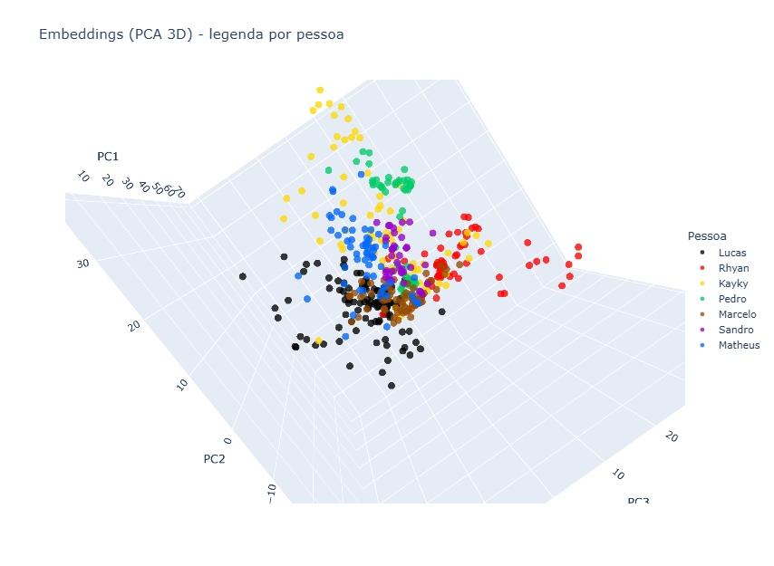

# CNN Face Recognition (Embeddings + PCA + KNN) com Open-Set (“Unknown”)

Projeto de Visão Computacional / Machine Learning para **reconhecimento facial por identidade** em um conjunto fechado de pessoas, treinando uma **CNN do zero** para gerar **embeddings (128D)** e usando **PCA + KNN** para classificação.  
Além do “closed-set”, implementei uma lógica de **open-set recognition**: o sistema deve conseguir **rejeitar** rostos de pessoas fora do treinamento (classe “Unknown”) usando um **threshold de distância** no espaço de embeddings.

> **Privacidade e ética**: o dataset é **privado**, composto por imagens de colegas com consentimento, e **não é publicado** neste repositório.

---

## Visão geral do pipeline

1. **Pré-processamento** (OpenCV): resize para 96×128 (RGB), blur leve e normalização [0, 1].
2. **Split estratificado**: 70% treino / 30% teste (antes do augmentation).
3. **Data augmentation no treino**: rotações leves, shifts, brilho, shear, zoom e flip horizontal.
4. **CNN (do zero)**: aprende a classificar as identidades e gera um **embedding de 128 dimensões**.
5. **Extração de embeddings**: embeddings para treino e teste via `embedding_model`.
6. **PCA**: redução de dimensionalidade (ex.: 32 componentes) para compactar o espaço.
7. **KNN**: classificação supervisionada em cima dos embeddings reduzidos.
8. **Open-set (Unknown)**: decisão por **distância euclidiana mínima** para o conjunto de treino; se a menor distância excede um **threshold**, retorna “Unknown”.

---

## Dados (dataset privado)

- Total: **350 imagens**
- Split: treino **245** / teste **105**
- Treino após augmentation: **1470 imagens** (aumento 6× contando original + 5 augmentations)
- Identidades (exemplo): 7 pessoas (classes) + 1 “desconhecido” usado apenas para teste open-set

> Observação: por se tratar de dataset pequeno e controlado, o objetivo aqui é demonstrar **pipeline, metodologia e avaliação**, não reivindicar robustez “produção”.

---

## Modelo (CNN)

Arquitetura (resumo):
- Conv2D(32) → MaxPool
- Conv2D(64) → MaxPool
- Conv2D(128) → MaxPool
- Flatten
- Dense(128, ReLU)  ← **embedding**
- Dropout(0.4)
- Dense(num_classes, Softmax)

Treino:
- Otimizador: Adam
- Loss: categorical crossentropy
- Épocas: 15
- Batch size: 32
- Validação: 15% do treino (validation_split)

---

## Resultados (closed-set)

Acurácia total no conjunto de teste: **90.48%**  
As imagens com o relatório e matrizes estão em `images/`.

Exemplos de visualizações:
- Relatório (precision/recall/f1): `images/results_classification_report.jpg`
- Matriz de confusão 7×7: `images/confusion_matrix_7x7.jpg`
- Acurácia por classe: `images/accuracy_by_class.jpg`
- Projeção de embeddings (PCA 3D): `images/embeddings_pca3d.jpg`

---

## Open-set (“Unknown”)

Para simular open-set, imagens de uma pessoa **fora do treinamento** são avaliadas.  
A decisão de “Unknown” é baseada na **menor distância euclidiana** do embedding (após PCA) até os embeddings do treino.

- Se `min_dist > threshold` → retorna **Unknown**
- Caso contrário → retorna a classe prevista pelo KNN

> Nota: o threshold é um hiperparâmetro e deve ser calibrado (ex.: analisando distribuições de distância intra vs inter-classe). Uma escolha ruim de threshold pode aumentar falsos aceites ou falsas rejeições.
